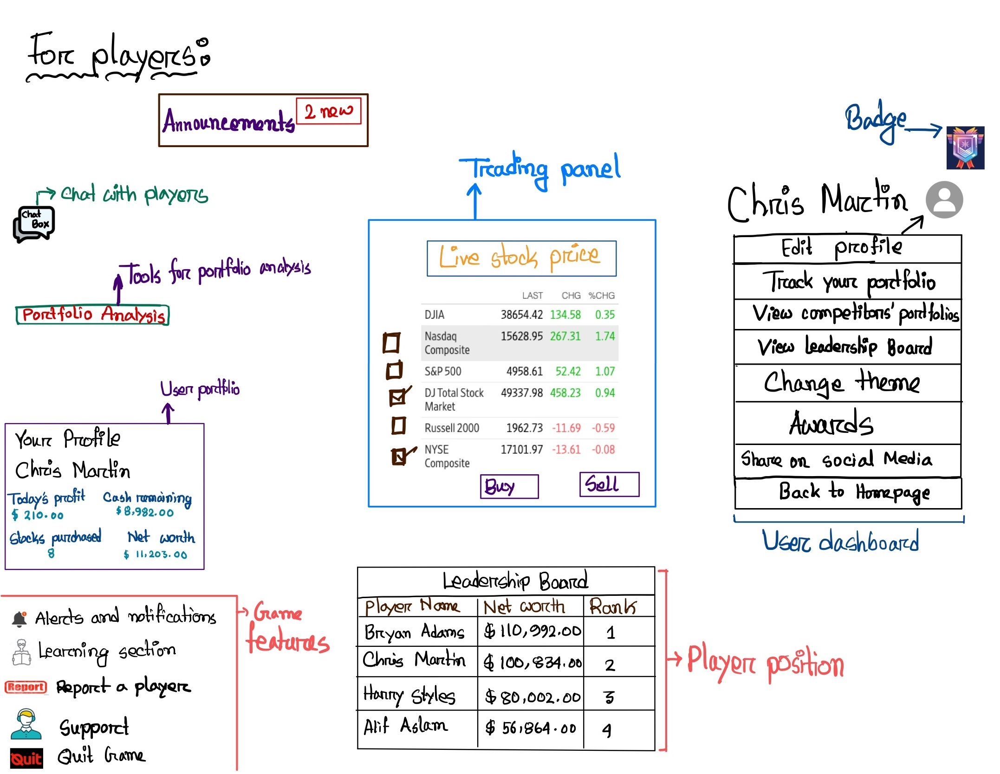
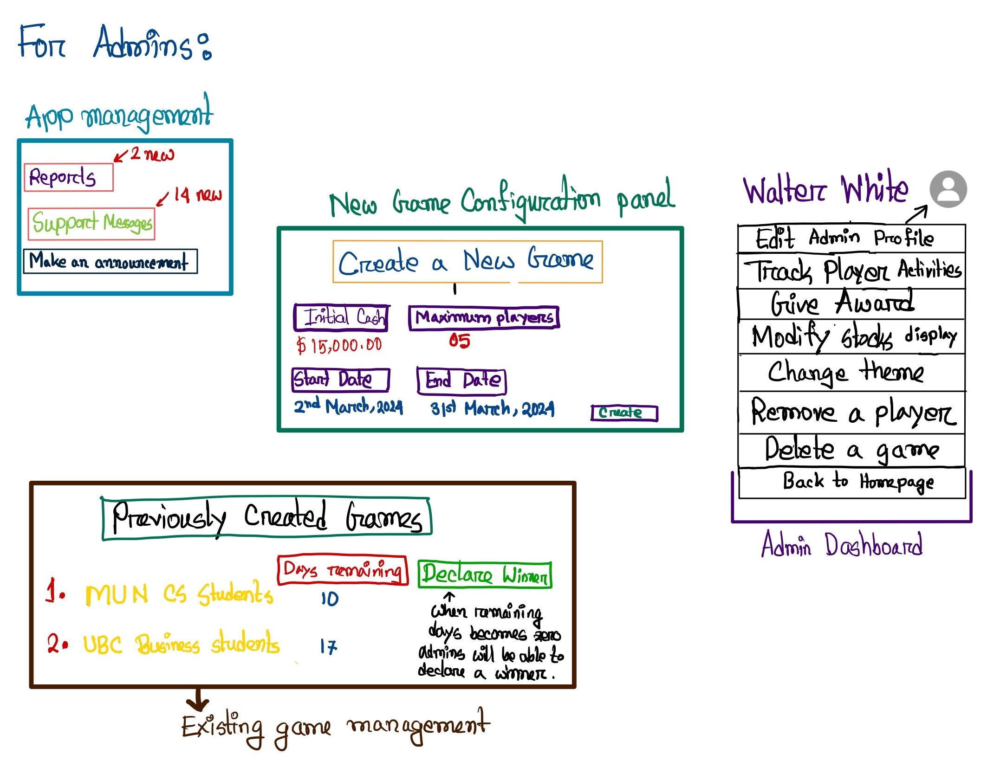

## Description
The stock trading game is a safe and competitive platform where people can improve their trading skills, understand how the market works, and create effective strategies. It uses real-time data from the New York Stock Exchange and has two interfaces: one for players and one for administrators. On the player's interface, users can sign up, buy and sell stocks, keep an eye on the latest stock prices, and more. The stock prices come from a financial data API, and players have a set time to build their portfolios. A leaderboard shows the values of participants' portfolios, and the winner is the one with the highest standing on the leaderboard at the end of the period. While the server will handle tasks like player registration, managing accounts, processing transactions, and integrating with the API, players can interact with the user interface at the same time.

For admins, the game provides a control panel to create and manage competitions. Admins can register players, set up game parameters such as duration, starting cash for portfolios, and track the progress of each game. They will keep track of all trades and activities of the players during the game. They are also responsible for declaring winners based on the highest portfolio value at the competition's end and maintaining the system to ensure a smooth and fair gaming experience. On the server side, there will be background processes for administrative tasks like creating and ending games, removing players, and updating stocks or player details.

## Screens
 

\
 

 
## Features 
|ID|Name|Access By|Short Description|Expected Implementation|Source of Idea|
|--|----|---------|-----------------|-----------------------|--------------|
|01|Player registration|Player|Players register for a particular game|Must implement|Project Instructions|
|02|Initial cash|Admin|Allocate all players a starting cash to their portfolios|Must implement|Project Instructions|
|03|Buy or Sell|Player|Allow players to buy or sell their stock at the current NYSE prices|Must implement|Project Instructions|
|04|Portfolio tracking|Both|Keep track of portfolio and its value|Must implement|Project Instructions|
|05|Winner declaration|Admin|Declare the game-winner based on portfolio value|Must implement|Project Instructions|
|06|Login and profile information management|Both|Both player and admin can manage their own login credentials and profile information (e.g., username, dob, profile picture, etc.)|Must implement|Project Instructions|
|07|Create game|Admin|Allow admins to create games|Must implement|Project Instructions|
|08|View competitors’ portfolios|Player|Option to view other players’ portfolios|Optional|Project Instructions|
|09|Transaction fees|Admin|Imply fees on every buy or sell transaction|Optional|Project Instructions|
|10|Tracking activities|Admin|Tracking all trades and activities of a player during the game|Must implement|Project Instructions|
|11|Game configuration|Admin|Set the duration and starting amount of a game|Must implement|Project Instructions|
|12|Real-time stock update|Both|Show live NYSE stock prices in the game|Must implement|Seen on other games|
|13|Chat channel|Player|Enable player communication with each other|Probably not unless it’s easy|Seen on other games|
|14|The Leadership Board|Player|Allow players to see their rankings by portfolio value|Likely to be done|Seen on other games|
|15|Alert and notifications|Player|Notify players when they reach their objective or alert them when their portfolio value goes significantly low|Likely to be done|Idea taken from course instructor|
|16|AI player|Player|Players can add AI-driven players to the game that can compete against human players to simulate market dynamics and provide a more challenging gameplay experience|Probably not unless it’s easy|Idea taken from course instructor|
|17|Dark Mode|Both|Provide a dark theme to reduce eye strain|Likely to be done|Lots of other games I know|
|18|Badge|Player|Reward players with badges for achieving specific milestones or winning competitions|Likely to be done|Lots of other games I know|
|19|Learning section|Player|Provide tutorials and resources on stock trading|Must implement|Lots of other games I know|
|20|Sharing on social media|Player|Share achievements or ranking in the leadership board on social platforms|Likely to be done|Lots of other games I know|
|21|Moving average|Player|An added feature to candlestick charts|Probably not unless its easy|Websites like Investopedia|
|22|Support section|Player|A section for players to raise issues, ask questions, and contact admins for help|Likely to be done|Lots of other games I know|
|23|Display stocks|Admin|Allow admins to select which stocks to display|Must implement|Classmate|
|24|Give award|Admin|Give a virtual trophy to the winner|Must implement|Lots of other games I know|
|25|Remove a player|Admin|Allows admins to remove players from the game for violations or at the player's request|Must implement|Lots of other games I know|
|26|Quit Game|Player|Allows players to voluntarily exit from a game before end result|Must implement|Lots of other games I know|
|27|Delete a game|Admin|Allows admins to delete a game, either before it starts or after it ends|Must implement|Classmate|
|28|Portfolio analysis|Player|Provides players with analytical tools to evaluate the performance of their portfolio over time|Probably not unless it is easy|Classmate|
|29|Report a player|Player|Allows players to report suspected cheating, harassment, or other violations of game rules by another player|Must implement|Classmate|
|30|Announcement board|Both|A section for admins to post updates, news, and information relevant to all players|Must implement|Classmate|

## Tools and packages
- Express.js
- Postman
- Prettier
- MongoDB 
- Bootstrap
- Live Server

## App API

1. POST /players/register
- Registers a new player for the game.

2. POST /games/create
- Allows an admin to create a new game.

3. POST /trades/execute
- Allows players to buy or sell stock.

4. GET /portfolio/{userId}
- Retrieves the portfolio details of a player.

5. GET /portfolio/competitors/{gameId}
- Option for players to view other competitors’ portfolios in the same game.

6. GET /stocks/realtime
- Shows live NYSE stock prices.

## Stock API

I have decided to use Alpha Vantage Support for this project. The following is the API call I might use to get current stocks and their sell/buy prices. 

GET https://www.alphavantage.co/query?function=TIME_SERIES_INTRADAY&symbol=IBM&interval=5min&apikey=[43EY530PF9EVVUQ2]

## Attributions

I have collborated with my classmate Tridib Paul Turjo and Ahmed Julkernain to discuss features and API related matters. 
